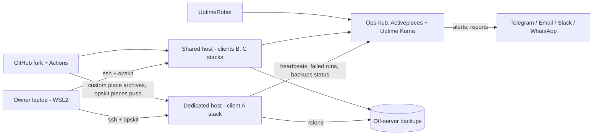

# Technical Architecture — Automation Ops Kit (Activepieces fork)

> Derived from `docs/SPEC.md`. If this conflicts with SPEC, SPEC wins. Upstream internals: upstream docs + pinned code (verify).

## 1. System context


## 2. Client stack (per client)
Caddy site `https://<domain>` → `app` (:8080 internal) · `worker` (replicas from config, `AP_FRONTEND_URL=http://app`) · `postgres` (volume `<id>_postgres`) · `redis`. Only Caddy publishes 80/443. Host cron: backup, failed-run detector, host health, heartbeat.

## 3. Repo structure (fork)
```
(upstream, unchanged)   packages/{server,react-ui,shared,pieces/community,...,ee}, docker-compose*.yml, Dockerfile*, tools/, docs/, AGENTS.md, CLAUDE.md, .github/workflows/*
opskit/
  bin/opskit            dispatcher (client, host, render, deploy, backup, restore, upgrade, flows, docs, report, doctor, selftest)
  bin/check             shellcheck + bats (+ --quick)
  lib/*.sh              logging, confirm, validate, render, ssh, docker, alerts
  schema/*.json         client.schema.json, host.schema.json
  templates/            compose.yml.tmpl, env.tmpl, caddy.tmpl, cron.tmpl, client.yaml.tmpl, alerts/, docs/, report/
  agent/                scripts copied to hosts: backup.sh, detect-failed-runs.sh, health.sh, heartbeat.sh
  flows/<template>/     flow.json, README.md, test/, CHECKLIST.md
  hub/                  ops-hub flows + Uptime Kuma setup notes
  hosts/                <host>.yaml host registry: IPs, mode, capacity (git-ignored)
  clients/              git-ignored registry
  tests/                bats tests + fixtures
packages/pieces/custom/<name>   our pieces
.github/workflows/opskit-ci.yml, opskit-pieces.yml
docs/                   SPEC, ADRs, runbooks/
```
Dependency direction: `bin → lib → templates/schema`; host agent scripts are standalone (no repo needed on hosts).

## 4. Command pattern
parse args → load + validate `client.yaml` → confirm if destructive → act (render/ssh/docker) → verify (health/worker/HTTPS) → record history in `client.yaml` → print summary; non-zero exit on failure; logs in `opskit/clients/<id>/logs/` (git-ignored).

## 5. Key flows
- **Deploy:** render → scp → compose up → wait health → worker check → Caddy reload → HTTPS check → register uptime monitor → heartbeat.
- **Backup:** pg_dump (container) → gzip → age-encrypt `.env` → rclone copy → prune → heartbeat/alert.
- **Restore:** fetch backup → new stack (staging/new host) → load dump → decrypt `.env` → up → smoke tests.
- **Upgrade:** backup → staging restore on new tag → smoke → promote prod → smoke → rollback if needed.
- **Alert:** detector finds failed run → POST ops-hub `/webhooks/<alert-router>` → route by client channels (+ owner Telegram) → de-dup window 30 min.

## 6. Sizing
Default per client: app 1 GB limit, worker 1 replica 1 GB, postgres 512 MB–1 GB, redis 128 MB; Phase 0 measurements override defaults. Shared host warning at 85% memory.

## 7. Cross-cutting
Secrets 600 perms; UTC on hosts; quiet hours per client timezone; all scripts `set -euo pipefail`; shellcheck; idempotency.
